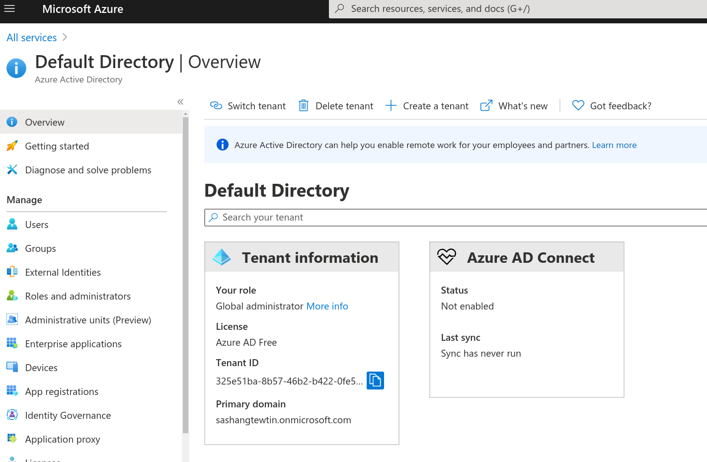

= Bash and Azure: From Zero to 100
Sashan Govender (c) 2020
:toc:
:sectnum:
:description: Unlocking the power of Azure with Bash
:keywords: bash, shell, azure, programming, code, script
:source-highlighter: pygments

== Introduction

The problem with Bash is that its syntax is quirky. I had trouble learning it and
had to pick it up on the job from scripts others had written. I often found that I could write it
but could never remember trivial things, like how to write an if statement or how to write a loop. I
found myself looking that up every time. It took me a while to cotton on to the underlying patterns.
This guide attempts to provide a sane and consistent viewpoint (my own) on how to use it. It may not
be the best most fancy way of doing things, but it's consistent. If you want fancy then see
https://www.tldp.org/LDP/abs/html/sha-bang.html[advanced bash programming]. It's advanced but
overwhelming and unstructured.

Azure has a great web based user interface but like all things with a UI, it's slow when you need to
repeat similar tasks. It's a lot faster to have a script to do that for you.

This guide gathers commonly used patterns in one place.
The guide starts with basic Bash and progresses into Azure.
It should be useful for engineers in software development, system administration or devops.
I expect that if you're reading this you're familiar with another language.

To begin you'll need:

- a Unix based operating system like a Mac or Linux machine
- a text editor
- an Azure account

Some notes:

- I don't differentiate between shell and Bash. This is to keep this document simple. It adds a lot
  of extra work to differentiate POSIX compliant shell from Bash and for most people it's not
  relevant.

=== Hello World

Start the terminal program.

At the command prompt type:

.Input
-------------------
$ echo "hello world"
-------------------

.Output
------------------
hello world
------------------

== A Starting Point

I like my shell scripts to start with a main function.

[source,bash]
----
include::main.sh[]
----

You can copy and paste the text above into a file.
To run it you'll need to enable execute permissions on the file using `chmod`.

----
chmod +x main.sh
./main.sh
----

File permissions are explained later.
Remember, to run the script prefix the file with `./`.
`.` points to the current directory.
Unlike Windows the current directory is not in the `PATH` environment variable which is why we
explicitly tell the shell the path to the binary to execute.

=== Command Line Arguments

All arguments to the script can be captured using `$@`. If you know which argument you want you can
use the positional arguments to get them.

[source,bash]
----
include::main1.sh[]
----
<1> `1` and `2` are positional arguments.
<2> `@` you can think of as a an array of all the positional parameters.

== Parameters

Parameters are Bash's variables.
Bash is untyped so you can think of them as strings.

.Setting a parameter
[source,bash]
----
VAR="some val"
----

WARNING: Spacing after a variable name matters. There can't be a space between the variable name and the value.
[source,bash]
----
VAR = "some val" #<1>
----
<1> Spaces after a paramter name are bad.

If you try and run this you'll see and error like:

`VAR: command not found`

Why? Because whenever Bash sees a space it thinks that the text preceding is the start of a command,
and tries to run it, but `VAR` is not a binary in the `PATH`, and it can't be found.

If you want to get at the value of a variable you need to prefix it with a `$`.
Placing the `$` in front of a parameter causes *parameter substitution*.

TIP: Best practice is to use double quotes when performing parameter substitution.

[source,bash]
----
VAR="some file"
touch "$VAR"
----

Why double quote? In the case above, `touch` is a program that creates a file. If double quotes were
not used then two files, `some` and `file`, would be created.

NOTE: Bash has quite a few special parameters. We've seen some already, the positional paramters
like `1` and `2` and `@` which expands all the positional paramters.

== Making decisions

If statements in Bash let us make decisions. The basic syntax is:

----
if <command>; then
fi
----

_command_ can be a function or a program.

With what we know so far lets make a script that searches a file for some text and prints *"found
it!"* if it finds the text.

[source, bash]
----
include::found-it.sh[]
----
<1> `grep` is a program that runs a regular expression search on the file. Regular expressions are a
complicated topic and some of it will be touched on later.
<2> We use positional arguments `1` and `2`. The first is the string to find. The second is the name of the
file.
<3> -q option to grep means _quiet_. It suppresses output from grep.

.Example
----
./found-it.sh "command" bash-0-to-100.adoc
found it!
----

Here we search of the string _command_ in this file.

If it finds the string then `grep` returns `0`. If not it returns `1`.
This might surprise you.
In shell script `0` is true and any other value is interpreted as false.

We can also use `if` statements with functions we define. Let's create a function `quiet_grep` which
calls `grep` with `-q`.

.quiet grep
[source,bash]
----
include::quiet-grep.sh[]
----
<1> Note the return value of 0 for truth.
<2> Call our new function `quiet_grep`.

IMPORTANT: Bash uses `0` for truth and any other value as false. This is different from other programming languages.

Can we use if statements with variables as in other languages?

[source,bash]
----
VAR=1
if $VAR; then
  echo "yes"
fi
----

.output
----
bash: 1: command not found
----

Doesn't look like it. This isn't how other languages work.

IMPORTANT: if statements run a _command_. You can't use a parameter _directly_ in an if statement.

If you can't directly use a parameter in an `if` statement, how do you test a value of a parameter?
If statements require a command which implies that there must be a command to test parameter
values. It's called `test`. You can see how to use it in the next example.

[source,bash]
----
VAR=1
if test $VAR -eq 1; then #<1>
  echo "yes"
fi
----
<1> `-eq` is short for equals

There are many other options to `test`. At the command prompt type `man test` to see the manual for
that command. You can move up and down inside the pager using `j` and `k`.  Use `q` to quit.

But writing `test` everytime I want to test something is awkward. Is there another way? Yes.

[source,bash]
----
VAR=1
if [ $VAR -eq 1 ]; then #<1>
  echo "yes"
fi
----
<1> [ is also a command.

But I thought you said if statements run commands only? Yes, that's true. `[` is a command. It's
often installed under /usr/bin.

----
ls -l '/usr/bin/['
-rwxr-xr-x 1 root root 59528 Mar  7 00:01 '/usr/bin/['
----

NOTE: Implementations of Bash will implement `[` as a builtin command. In other words it runs in the
same process as the interpreter and the external command `/usr/bin/[` isn't called.

=== Numeric and String comparisons

When comparing strings and numbers `test` of `[` take different comparions parameters. Generally if
conventional boolean operators are used, then it's a string comparison taking place. If it's `-eq` or
`-gt`, single dash options, then numeric comparison is taking place.

You can see the difference in the following two examples.

In the first example numeric comparison is taking place. The values are equal. `01` and `1` are
numerically the same.

[source,bash]
----
VAR=1
if [ "$VAR" -eq 01 ]; then
  echo "equal"
fi
----

.output
-------
equal
-------

In this next example we compare the same values but as strings.

[source,bash]
----
include::string-comp.sh[]
----

.output
-------
not equal
-------

=== Negation and Boolean Operators

Negation uses `!` like a lot of other languages to invert the truth value of an expression.

[source, bash]
----
if ! true; then #<1>
  echo "false"
else
  echo "true"
fi
----
<1> true is a command. If you type `which true` at the command prompt you'll find it. There is also
a `false` command.

.output
----
true
----

You can combine expressions using boolean operators `&&` and `||`.

[source,bash]
----
include::boolean.sh[]
----

`&&` applies short circuit evaluation. In other words, if the first expression is false then
the following expressions are not evaluated. A similar thing happens with `||`. In this case, if the
first expression is true, then the remaining expressions are not evaluated.

=== Case statements

:TODO

== Authenticating with Azure

When using a command line tool the recommended way to authenticate is by using a service provider.
What is a service provider? It's an indentity not linked to a user, and can be assigned roles. This
means that operations that the command line tool performs can be restricted.

=== Creating a Service Provider

----
az ad sp create-for-rbac --name bash-azure-cli --create-cert
----

.output
----
Changing "bash-azure-cli" to a valid URI of "http://bash-azure-cli", which is the required format used for service principal names
Creating a role assignment under the scope of "/subscriptions/57216d61-eb4c-4f65-af23-b771e31ed4b6"
Please copy /home/sashan/tmp0vrctoqh.pem to a safe place. When you run 'az login', provide the file path in the --password argument
{
  "appId": "f6b71ceb-fb84-4337-a504-8606f404037e",
  "displayName": "bash-azure-cli",
  "fileWithCertAndPrivateKey": "/home/sashan/tmp0vrctoqh.pem",
  "name": "http://bash-azure-cli",
  "password": null,
  "tenant": "325e51ba-8b57-46b2-b422-0fe56493b316"
}
>
----

This will create a service principal 'http://bash-azure-cli' and a PEM cert
file. Copy the file somewhere safe.

----
cp /home/sashan/tmp0vrctoqh.pem bash-azure-cli.pem
----

Login again using the service principal name. 

Have a look in the *Azure Portal -> Identity -> Azure Active Directory* for the tenant parameter.
You'll need it to login using the service principal.

.Tenant ID
[#tenant-id]

Then login using the service principal user name, the cert and the tenant id.

.Login using the service principal
----
az login --service-principal -u http://bash-azure-cli -p bash-azure-cli.pem --tenant 325e51ba-8b57-46b2-b422-0fe56493b316
----

.output
----
[
  {
    "cloudName": "AzureCloud",
    "homeTenantId": "325e51ba-8b57-46b2-b422-0fe56493b316",
    "id": "57216d61-eb4c-4f65-af23-b771e31ed4b6",
    "isDefault": true,
    "managedByTenants": [],
    "name": "Pay-as-you-go",
    "state": "Enabled",
    "tenantId": "325e51ba-8b57-46b2-b422-0fe56493b316",
    "user": {
      "name": "http://bash-azure-cli",
      "type": "servicePrincipal"
    }
  }
]
----

